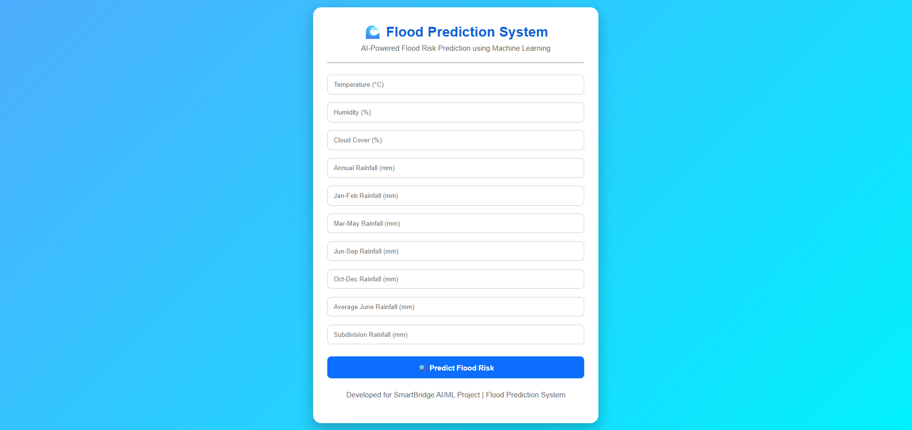
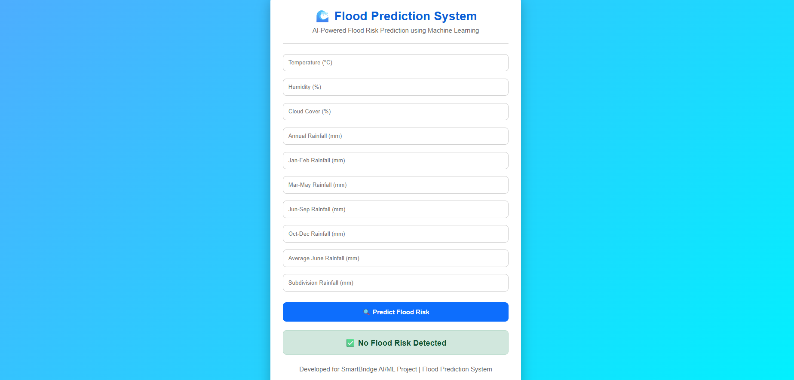

# Rising_waters_Smartbridge

# 🌊 Flood Prediction System

## 📌 Project Overview

The Flood Prediction System is a Machine Learning based web application that predicts the possibility of floods using rainfall and weather-related data. It helps users estimate flood risk by entering environmental parameters through an easy-to-use web interface.

## 🚀 Features

- Predicts flood risk using Machine Learning
- Simple and user-friendly web interface
- Accepts rainfall and weather-related inputs
- Displays instant prediction results
- Built using Flask for web deployment
- Easy to run on a local computer

## 🛠️ Technologies Used

| Technology | Purpose |
|------------|---------|
| Python | Programming Language |
| Flask | Web Framework |
| Pandas | Data Processing |
| Scikit-learn | Machine Learning |
| Joblib | Saving and Loading the Model |
| HTML | Web Page Structure |
| CSS | Web Page Styling |
| Git | Version Control |
| GitHub | Project Hosting |
| VS Code | Code Editor |

## 📊 Input Features

The prediction model uses the following inputs:

- Temperature
- Humidity
- Cloud Cover
- Annual Rainfall
- Jan-Feb Rainfall
- Mar-May Rainfall
- Jun-Sep Rainfall
- Oct-Dec Rainfall
- Average June Rainfall
- Subdivision Rainfall

## 📂 Project Structure

```
Rising_waters_Smartbridge/
│
├── app/
│   ├── static/
│   │   └── style.css
│   │
│   ├── templates/
│   │   └── index.html
│   │
│   └── app.py
│
├── dataset/
│   └── flood_dataset.xlsx
│
├── model/
│   ├── flood_prediction_model.pkl
│   └── scaler.pkl
│
├── notebooks/
│
├── images/
│
├── src/
│
└── README.md
```

## ⚙️ Installation

### Step 1

Clone the repository

```bash
git clone git clone https://github.com/sshanvaz2006/Rising_waters_Smartbridge.git
```

### Step 2

Open the project folder

```bash
cd Rising_waters_Smartbridge
```

### Step 3

Install the required libraries

```bash
pip install -r requirements.txt
```

### Step 4

Run the Flask application

```bash
python app/app.py
```

### Step 5

Open your browser

```
http://127.0.0.1:5000
```

## ▶️ How to Use

1. Start the Flask application.
2. Open your browser and visit:

   http://127.0.0.1:5000

3. Enter the required weather and rainfall values.
4. Click **Predict Flood Risk**.
5. The application will display whether a flood is likely or not.

## 📷 Screenshots

### Home Page



### Prediction Result



## 📈 Future Scope

This project can be enhanced by:

- Integrating real-time weather APIs.
- Improving model accuracy using larger datasets.
- Sending SMS or email flood alerts.
- Displaying flood-prone areas on interactive maps.
- Developing a mobile application for easier access.

## 👨‍💻 Developer

**Name:** Shanvaz

**Project:** Flood Prediction System

**Organization:** SmartBridge AI/ML Internship

**Purpose:** Academic Project

## 📄 License

This project was developed for educational and academic purposes as part of the SmartBridge AI/ML Internship.