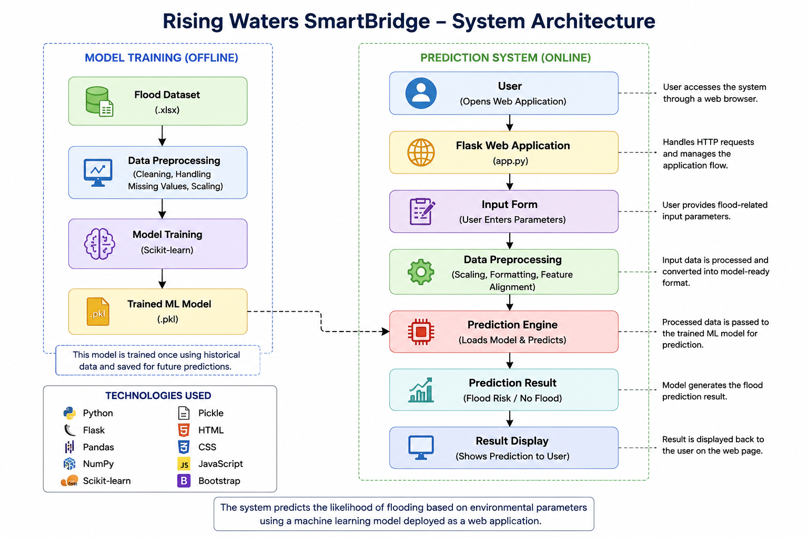
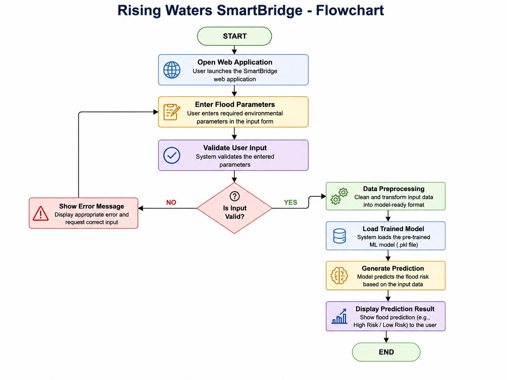
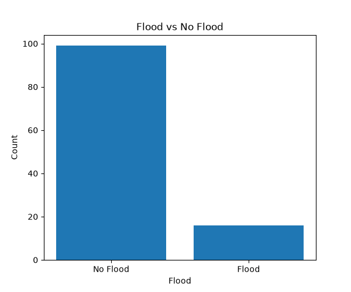
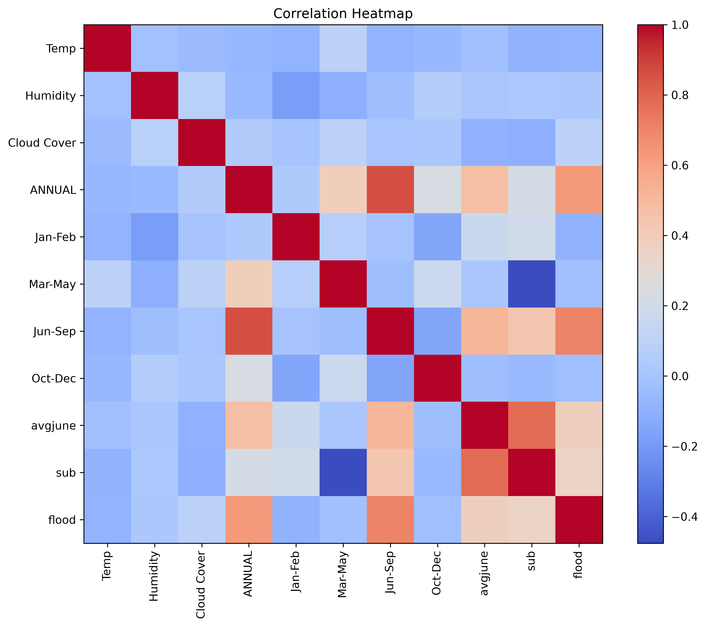
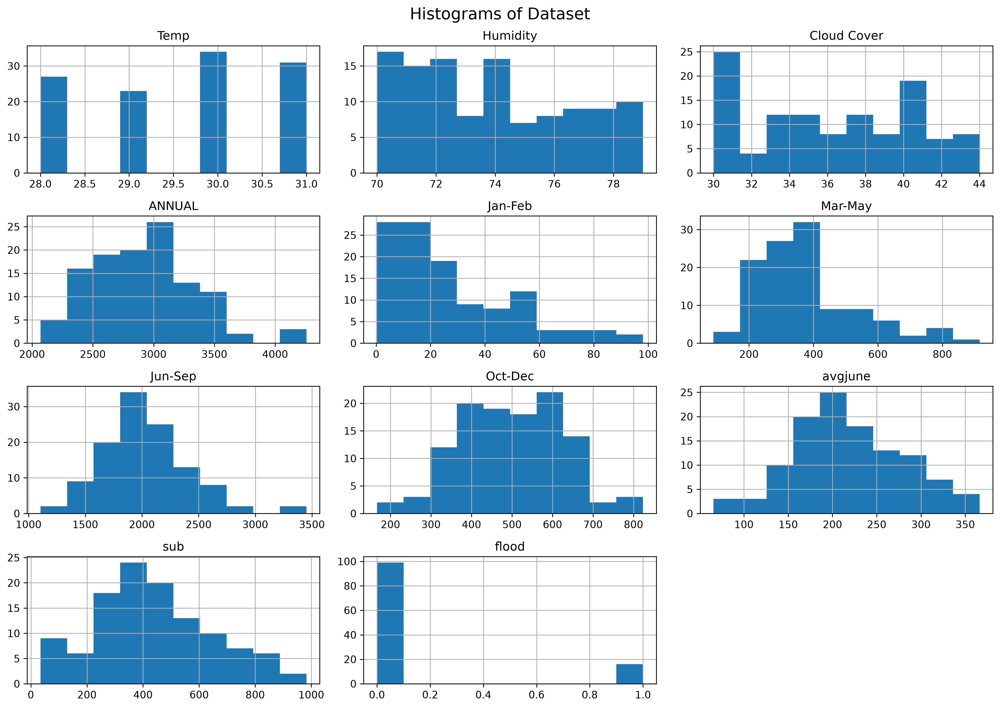

# 🌊 Rising Waters - Flood Prediction System

## 📌 Project Overview

The **Flood Prediction System** is a Machine Learning-based web application that predicts the possibility of floods using rainfall and weather-related data. It helps users estimate flood risk by entering environmental parameters through a simple and user-friendly web interface.

---

## 🚀 Features

- Predicts flood risk using Machine Learning
- User-friendly Flask web application
- Accepts rainfall and weather-related inputs
- Displays instant prediction results
- Fast and lightweight prediction model
- Easy to deploy and run locally

---

## 🛠️ Technologies Used

| Technology | Purpose |
|------------|---------|
| Python | Programming Language |
| Flask | Web Framework |
| Pandas | Data Processing |
| NumPy | Numerical Computing |
| Scikit-learn | Machine Learning |
| Joblib | Model Serialization |
| HTML | Web Structure |
| CSS | Styling |
| Git | Version Control |
| GitHub | Project Hosting |
| VS Code | Development Environment |

---

## 📊 Input Features

The prediction model uses the following parameters:

- Temperature
- Humidity
- Cloud Cover
- Annual Rainfall
- Jan-Feb Rainfall
- Mar-May Rainfall
- Jun-Sep Rainfall
- Oct-Dec Rainfall
- Average June Rainfall
- Subdivision Rainfall

---

## 📂 Project Structure

```
Rising_waters_Smartbridge/
│
├── app/
│   ├── static/
│   ├── templates/
│   └── app.py
│
├── assets/
│   ├── diagrams/
│   │   ├── architecture_diagram.png
│   │   └── flowchart.png
│   │
│   └── screenshots/
│       ├── home_page.png
│       ├── prediction_result.png
│       ├── flood_distribution.png
│       ├── correlation_heatmap.png
│       └── histograms.png
│
├── dataset/
├── demo/
├── docs/
├── model/
├── notebooks/
├── presentation/
├── src/
├── README.md
└── requirements.txt
```

---

## ⚙️ Installation

### Step 1: Clone the Repository

```bash
git clone https://github.com/sshanvaz2006/Rising_waters_Smartbridge.git
```

### Step 2: Navigate to the Project Folder

```bash
cd Rising_waters_Smartbridge
```

### Step 3: Install Dependencies

```bash
pip install -r requirements.txt
```

### Step 4: Run the Flask Application

```bash
python app/app.py
```

### Step 5: Open Your Browser

```
http://127.0.0.1:5000
```

---

## ▶️ How to Use

1. Run the Flask application.
2. Open **http://127.0.0.1:5000** in your browser.
3. Enter the required weather and rainfall details.
4. Click **Predict Flood Risk**.
5. View the prediction result.

---

## 🏗️ System Architecture



---

## 🔄 System Flowchart



---

## 📷 Screenshots

### Home Page


### Prediction Result


### Flood Distribution



### Correlation Heatmap



### Histograms



---

## 📈 Future Scope

- Integrate real-time weather APIs
- Improve prediction accuracy using larger datasets
- Send SMS and Email flood alerts
- Display flood-prone regions using GIS maps
- Develop Android and iOS mobile applications

---

## 👨‍💻 Developer

**Name:** SHAIK SHANVAZ

**Roll Number:** 23F21A05A6

**Department:** Computer Science and Engineering

**College:** Gates Institute Of Technology, Gooty

**Internship:** SmartBridge AI & ML Internship

---

## 📄 License

This project was developed for educational purposes as part of the SmartBridge AI & ML Internship.